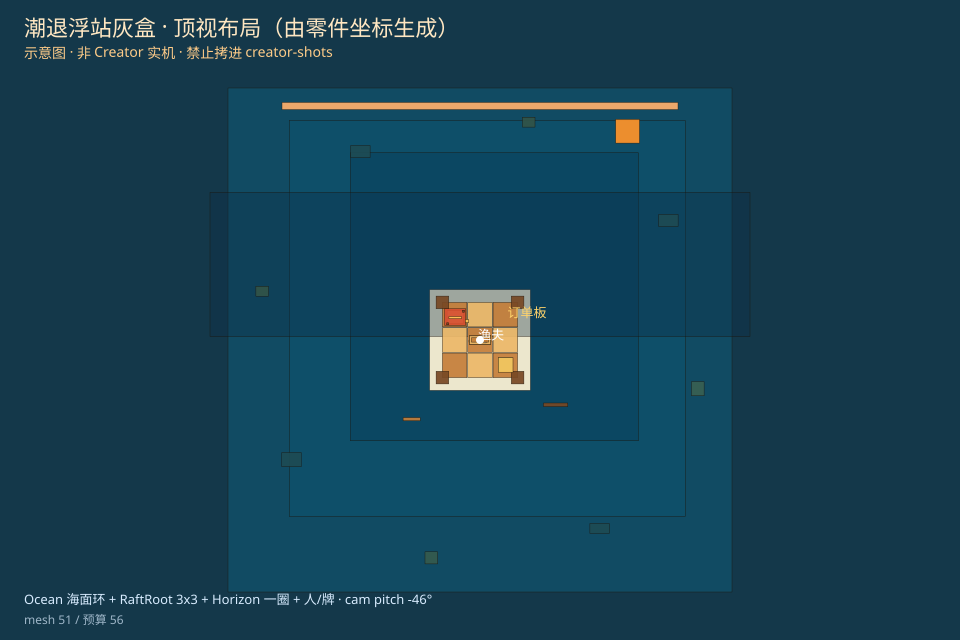

# 潮退浮站 · 地图灰盒

港口世界底座：一眼读出 **海 + 浮台 + 人 + 远景**。
表现层旁路，不改甩拽扑手感、不改 11/90、不碰广告/IAP。玩家可见文案只用原创：潮退浮站、浮岛小站、订单板、潮间漂木。

云端 **没有** Cocos Creator，本页是节点/构图说明，**不是**实机截图。不要把示意图拷进 `docs/stage3d/creator-shots/`。

## 节点层级

运行时由 `HarborStage` 挂到场景根，名 `HarborWorld`：

```
HarborWorld
├─ HarborLight          一盏平行光（关阴影）
├─ HarborCamera         斜俯视家门口，见 TIDE_STATION.cam
├─ Ocean
│  ├─ Water             主海面 + 顶点波 + 运行时自绘水纹
│  ├─ Mid / Deep / FarBand
│  └─ FoamN/E/S/W       浮台四周泡沫环（不是整块白板）
├─ Horizon              半淹楼影一圈
│  ├─ Horizon_i_Base / Wall / Roof   每座三件套
│  ├─ HorizonHaze / HorizonSun
│  └─ DriftA / DriftB
├─ RaftRoot
│  ├─ Foundation
│  │  └─ Foundation_ix_iz_P0…P4     每格 5 条木板，缝是空隙
│  ├─ Pontoon* / Crate / Stall…
│  ├─ OrderBoard        Post + Frame + 深色 Face + Header + Bar
│  └─ Fisherman         阿笠：斗笠冠+宽檐 / 蓑衣三层 / 青绿衣 / 竿
├─ HarborBoat
└─ Tidewood
```

零件：`assets/scripts/domain/TideStation.ts`  
自绘木纹/水纹：`assets/scripts/domain/StageSkin.ts`（64px，运行时上传，**不进包体**）  
实例化：`assets/scripts/world/HarborStage.ts` + `StageBuild.ts`  
猎场 `DeckStage` 仍用 `waterParts` / `dockParts`，本刀不改出海手感。

## 构图（斜俯视家门口，示意）

相机在浮台南侧（家门口）抬高，俯角约 −34°：看见海环、木板条甲板、站姿渔夫侧面、半淹楼的墙和屋顶。

```
            Horizon（基座+墙+屋顶一圈）
                    ~~~ 分层海 + 浪 ~~~
              ┌─┬─┬─┬─┬─┐
              │木板条甲板 │     ← RaftRoot 3×3 × 5 plank
         海   │人  摊  箱│   海
              │竿     牌│
              └─┴─┴─┴─┴─┘
              渔夫     订单板
                    ~~~
              HarborCamera ↗ 家门口
```

成功标准（代码侧）：海有浪/分层/泡沫环；楼是多件套剪影；人是年轻版阿笠剪影；牌是框+深色面；甲板是木板条不是纯色格。

## 主角锁定阿笠

港口灰盒主角锁定为 **年轻版「阿笠」**（斗笠蓑衣清爽钓手）。**锁定年轻版 A。** 不做拾潮、不做港仔。程序低模 primitives，不引竞品资源。

剪影零件（`fishermanParts()`）：

- `FisherHatCrown` + `FisherHatBrim`：宽檐斗笠（帽冠 + 大檐）
- `FisherMino` / `FisherMinoMid` / `FisherMinoHem`：厚蓑衣肩披，三层梯形盒子，下摆更宽
- `FisherTorso`：青绿上衣；头身比偏青年（头略大、躯干略短）
- `FisherArm*` / `FisherLeg*` / `FisherBoot*`：站姿四肢
- `FisherRod`：清楚的长钓竿轮廓

常量：`HARBOR_HERO.name === "阿笠"`。玩家可见港口标题仍是「潮退浮站 · 浮岛小站」。

顶视布局（**由零件坐标生成，不是 Creator 实拍**，禁止拷进 `creator-shots/`）：



## 本机一键预览（必须有 Creator 3.8.8）

云端 / CI **缺 Creator**，这里打不出 `build/web-desktop`，也不假装已出包。有 Creator 的机器用下面两条，浏览器应进港口灰盒：

```bash
# 1) 命令行出 web-desktop（找不到 Creator 会 exit 2，文案含「缺 Creator」）
node tools/try-web-desktop-build.mjs

# 2) 本地起静态服
npx --yes serve build/web-desktop -l 8765
# 或：npm run serve:web-desktop
```

浏览器打开 **http://127.0.0.1:8765/** 。路径：Boot.scene → RuntimeHome → HarborStage。**不要点出海。** 应看见海浪/泡沫环、木板条甲板、站姿渔夫、框式订单板、半淹楼三件套一圈。

也可以一行：

```bash
node tools/try-web-desktop-build.mjs && npx --yes serve build/web-desktop -l 8765
```

更快、不必出包：Creator 打开仓库根 → `assets/scenes/Boot.scene` → 预览（`Ctrl+P` / `Cmd+P`）。

探测（无 Creator 也只打印「缺 Creator」，不冒充已出包）：

```bash
node tools/try-web-desktop-build.mjs --probe-only
```

实拍仍只认 `docs/stage3d/creator-shots/`（现 0/4）。SVG / 代理 / expect **一律不算**。清单：`npm run shots:list`。

## 扩建地基

默认 `TIDE_STATION.foundationGrid = 3`，每格 `planksPerTile = 5`。

- `foundationCellCenter(ix, iz)` / `foundationPlankName(ix, iz, p)`
- `expandFoundationGrid(n)` / `foundationParts(tier, n)`
- 浮台 1→2 仍只换皮（格子略放大 + 棚/灯）

包体：主包 **0 贴图文件**；运行时自绘 2 张 ≤64px。一盏光，关阴影后处理。港口 mesh 上限见 `STAGE_BUDGET.maxHarborMeshes`（现 128）。

`tools/first-run-preview`（`:8766`）是 2D 代理，**不算** 3D 实机，也不能拷进 `creator-shots/`。
